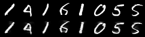
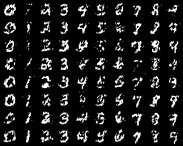

# Masked Autoencoder for Distribution Estimation(MADE) for MNIST
PyTorch implementation of MADE for MNIST

## Description
This is implementation of Masked Autoencoder for Distribution Estimation(MADE). To facilitate sampling numbers, I used one-hot encoding of numbers as additional input. The shape of input is batch size * 794 (not 784). This implementation includes direct connection between input and output and connectivity-agnostic trainint. But i didn't implement order-agonostic training.

## Results
The following results were obtained with the default setting. (command: python made.py)

<table align='center'>
<tr align='center'>
<td> Reconstruction </td>
<td> Sampling </td>
</tr>
<tr>
<td>
<td>
</tr>
</table>

## References
The implementation is based on:  
[1] https://arxiv.org/abs/1502.03509  

